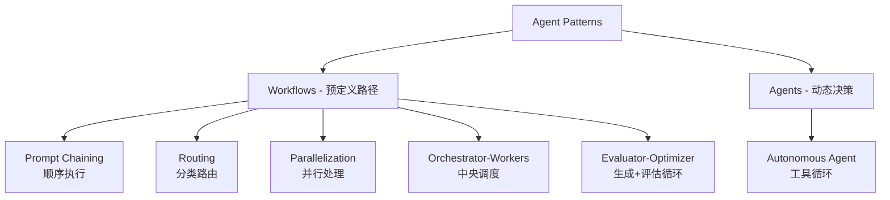

# PRD Agent 学习与开发计划

## 目标
为技术团队构建一个 AI PRD 生成 Agent，能够根据产品想法自动生成结构化的产品需求文档。

---

## 阶段 1: 理论学习(1-2 天)

### 1.1 核心资料阅读

| 优先级 | 资料 | 时长 | 关键内容 |
|--------|------|------|----------|
| ⭐⭐⭐ | [Building Effective Agents - Anthropic](https://www.anthropic.com/research/building-effective-agents) | 30min | 6 种 Agent 模式、何时使用 Workflow vs Agent |
| ⭐⭐⭐ | [MCP 官方文档](https://modelcontextprotocol.io/docs/getting-started/intro) | 20min | MCP 协议基础、Tool 连接标准 |
| ⭐⭐ | [Code Execution with MCP](https://www.anthropic.com/engineering/code-execution-with-mcp) | 25min | 如何减少 Token 消耗、渐进式披露(Progressive Disclosure) |
| ⭐⭐ | [Harness Design](https://www.anthropic.com/engineering/harness-design-long-running-apps) | 30min | Planner-Generator-Evaluator 架构 |
| ⭐ | [Demystifying Evals](https://www.anthropic.com/engineering/demystifying-evals-for-ai-agents) | 20min | 如何评估 Agent 性能 |

### 1.2 概念框架整理

#### Anthropic Agent 设计的 6 种核心模式



**决策树：PRD Agent 应该用哪种模式？**

```
用户需求: "根据产品想法生成 PRD"
↓
PRD 结构是否固定? 
├─ 是 → Workflow (推荐 Prompt Chaining)
│   └─ 生成需求是否需要迭代优化?
│       ├─ 是 → Evaluator-Optimizer
│       └─ 否 → 纯 Prompt Chaining
│
└─ 否 → Agent (Orchestrator-Workers)
    └─ 需要访问外部数据?
        ├─ 是 → 集成 MCP Servers
        └─ 否 → 纯 LLM 循环
```

#### 对于 PRD Agent 的推荐方案

**初版 (MVP)**: `Prompt Chaining`
- PRD 有标准结构(背景、目标、功能列表、验收标准)
- 可预测步骤:
  1. 理解产品想法
  2. 生成大纲
  3. 逐章节展开
  4. 生成验收标准

**迭代版**: `Evaluator-Optimizer`
- 添加评估智能体检查:
  - PRD 是否符合 SMART 原则
  - 功能描述是否清晰
  - 缺失关键章节

**完整版**: `Orchestrator-Workers + MCP`
- Orchestrator 分解任务:
  - Worker 1: 竞品分析(通过 MCP 调用搜索 API)
  - Worker 2: 用户调研总结(读取内部文档)
  - Worker 3: 技术可行性评估
- 最终合成完整 PRD

---

## 阶段 2: 环境搭建与 Hello World (半天)

### 2.1 技术栈选择

```bash
# 推荐技术栈
Node.js + TypeScript  # Anthropic SDK 支持最好
├─ @anthropic-ai/sdk  # Claude API
├─ @modelcontextprotocol/sdk  # MCP 客户端
└─ zod  # 输入输出验证
```

**为什么不用 LangChain？**
- Anthropic 官方建议:"从 LLM API 直接开始,框架抽象层会掩盖底层细节"
- 对于学习阶段,直接用 Anthropic SDK 更能理解原理

### 2.2 第一个 Agent (15min 实现)

创建 `hello-prd-agent.ts`:

```typescript
import Anthropic from "@anthropic-ai/sdk";

const client = new Anthropic({ apiKey: process.env.ANTHROPIC_API_KEY });

async function generatePRD(productIdea: string) {
  // Step 1: 生成大纲
  const outlineResponse = await client.messages.create({
    model: "claude-opus-4.6",
    max_tokens: 2000,
    messages: [{
      role: "user",
      content: `作为产品经理,为以下想法生成 PRD 大纲:\n\n${productIdea}\n\n输出格式:\n1. 产品背景\n2. 目标用户\n3. 核心功能\n4. 验收标准`
    }]
  });
  
  const outline = outlineResponse.content[0].text;
  console.log("===== PRD 大纲 =====\n", outline);
  
  // Step 2: 基于大纲展开完整 PRD
  const fullPRDResponse = await client.messages.create({
    model: "claude-opus-4.6",
    max_tokens: 4000,
    messages: [{
      role: "user",
      content: `基于以下大纲,生成完整的 PRD 文档:\n\n${outline}\n\n要求:\n- 每个章节详细展开\n- 包含具体的数据指标\n- 使用 Markdown 格式`
    }]
  });
  
  return fullPRDResponse.content[0].text;
}

// 测试
generatePRD("一个帮助技术团队做 AI 转型的工具平台").then(console.log);
```

**运行**:
```bash
npm install @anthropic-ai/sdk
export ANTHROPIC_API_KEY="your-api-key"
npx ts-node hello-prd-agent.ts
```

---

## 阶段 3: 实现 Evaluator-Optimizer 模式 (1 天)

### 3.1 为什么需要评估循环?

**问题**: 单次生成的 PRD 可能:
- 功能描述模糊("提升用户体验" ❌)
- 缺少关键章节(忘记写风险评估)
- 验收标准不符合 SMART 原则

**解决方案**: 添加 Evaluator Agent 检查质量

### 3.2 代码实现

```typescript
// evaluator-optimizer-prd.ts
async function generatePRDWithEval(productIdea: string, maxIterations = 3) {
  let currentPRD = await generateInitialPRD(productIdea);
  
  for (let i = 0; i < maxIterations; i++) {
    // Evaluator: 评估当前 PRD 质量
    const evaluation = await evaluatePRD(currentPRD);
    
    if (evaluation.isGood) {
      console.log(`✅ PRD 通过评估 (第 ${i+1} 轮)`);
      break;
    }
    
    // Optimizer: 根据反馈改进
    console.log(`🔄 改进建议: ${evaluation.feedback}`);
    currentPRD = await improvePRD(currentPRD, evaluation.feedback);
  }
  
  return currentPRD;
}

async function evaluatePRD(prd: string) {
  const response = await client.messages.create({
    model: "claude-sonnet-4.5",  // 评估用更便宜的模型
    max_tokens: 1000,
    messages: [{
      role: "user",
      content: `评估以下 PRD 质量,检查:
1. 是否有明确的用户画像
2. 功能描述是否可操作(避免"提升体验"这类模糊词)
3. 验收标准是否符合 SMART 原则
4. 是否包含风险评估章节

PRD:
${prd}

输出格式(JSON):
{
  "isGood": true/false,
  "feedback": "具体改进建议",
  "score": 1-10
}`
    }]
  });
  
  return JSON.parse(response.content[0].text);
}
```

**关键设计点**:
- Evaluator 用更便宜的模型(Sonnet vs Opus)节省成本
- 明确的评估标准(避免"这个 PRD 不够好"这种模糊反馈)
- 设置最大迭代次数防止死循环

---

## 阶段 4: 集成 MCP Servers (2-3 天)

### 4.1 为什么需要 MCP?

PRD 生成可能需要访问外部数据:
- 📂 读取公司内部产品规范文档
- 🔍 搜索竞品 PRD 示例
- 📊 查询用户调研数据库
- 📝 保存生成的 PRD 到 Notion/Google Docs

**传统方式问题**: 每个数据源需要写自定义集成代码
**MCP 方式**: 一次性实现 MCP 客户端,接入整个 MCP Server 生态

### 4.2 快速上手 MCP

#### 安装预构建的 MCP Server

```bash
# 安装文件系统 Server (读取本地文档)
npm install @modelcontextprotocol/server-filesystem

# 安装 Google Drive Server (云端文档)
npm install @modelcontextprotocol/server-gdrive

# 启动 MCP Server
npx @modelcontextprotocol/server-filesystem /path/to/docs
```

#### Agent 连接 MCP Server

```typescript
import { Client } from "@modelcontextprotocol/sdk/client/index.js";
import { StdioClientTransport } from "@modelcontextprotocol/sdk/client/stdio.js";

// 连接到文件系统 MCP Server
const transport = new StdioClientTransport({
  command: "npx",
  args: ["@modelcontextprotocol/server-filesystem", "/path/to/docs"]
});

const mcpClient = new Client({
  name: "prd-agent",
  version: "1.0.0"
}, {
  capabilities: {}
});

await mcpClient.connect(transport);

// 现在 Agent 可以通过 MCP 读取文档了
const tools = await mcpClient.listTools();
console.log("可用工具:", tools);
// 输出: [{ name: "read_file", description: "读取文件内容" }, ...]
```

#### 在 PRD Agent 中使用 MCP Tools

```typescript
async function generatePRDWithContext(productIdea: string) {
  // 1. 通过 MCP 读取公司 PRD 模板
  const templateContent = await mcpClient.callTool("read_file", {
    path: "/docs/templates/prd-template.md"
  });
  
  // 2. 调用 Claude 生成 PRD
  const response = await client.messages.create({
    model: "claude-opus-4.6",
    max_tokens: 4000,
    tools: [
      {
        name: "read_file",
        description: "读取公司文档库中的文件",
        input_schema: {
          type: "object",
          properties: {
            path: { type: "string", description: "文件路径" }
          }
        }
      }
    ],
    messages: [{
      role: "user",
      content: `使用公司标准模板生成 PRD:\n\n模板:\n${templateContent}\n\n产品想法:\n${productIdea}`
    }]
  });
  
  return response.content[0].text;
}
```

### 4.3 MCP 的核心优势(对比直接 Tool Calling)

| 维度 | 直接 Tool Calling | MCP |
|------|------------------|-----|
| **工具定义** | 每次在 Prompt 里写完整定义 | MCP Server 自动提供 |
| **Token 消耗** | 上百个 Tools 需要几万 Tokens | 按需加载(Progressive Disclosure) |
| **生态** | 需要自己实现所有工具 | 复用社区的 MCP Servers |
| **维护成本** | API 变更需要改 Prompt | 只需更新 MCP Server |

**实际案例**: Anthropic 博客提到,使用 Code Execution + MCP 可以将 Token 消耗从 150,000 降到 2,000(节省 98.7%)

---

## 阶段 5: 生产级优化 (3-5 天)

### 5.1 参考 Anthropic 的 Harness Design 原则

如果你的 PRD Agent 需要多小时运行(比如需要大量调研),可以参考 Harness Design:

```
┌─────────────────────────────────────────┐
│  Planner Agent                         │
│  输入: 产品想法                         │
│  输出: PRD 生成计划                     │
│  - 需要调研哪些竞品?                    │
│  - 需要读取哪些内部文档?                │
│  - PRD 应包含哪些章节?                  │
└─────────────────────────────────────────┘
              ↓
┌─────────────────────────────────────────┐
│  Generator Agent (Sprint 模式)          │
│  Sprint 1: 生成"产品背景"章节           │
│  Sprint 2: 生成"功能列表"章节           │
│  Sprint 3: 生成"技术架构"章节           │
│  每个 Sprint 结束交由 Evaluator 检查    │
└─────────────────────────────────────────┘
              ↓
┌─────────────────────────────────────────┐
│  Evaluator Agent                        │
│  检查每个章节质量,给出改进建议          │
│  低于阈值则打回 Generator 重写          │
└─────────────────────────────────────────┘
```

**何时需要 Harness?**
- PRD 需要多个小时生成(包含大量调研)
- 成本可接受($100-200/次)
- 需要高质量输出(值得多次迭代)

**何时不需要 Harness?**
- 简单 PRD,10 分钟内生成
- 预算有限(<$10/次)
- 用户可以手动迭代

### 5.2 工具设计的最佳实践(Anthropic Appendix 2)

**反例** (模型容易出错):
```typescript
// ❌ 工具描述模糊
{
  name: "save_prd",
  description: "保存 PRD",
  parameters: {
    content: "string"
  }
}
```

**正例** (符合 Anthropic 推荐):
```typescript
// ✅ 详细的工具文档
{
  name: "save_prd",
  description: `保存 PRD 到指定位置
  
示例用法:
save_prd({
  content: "# PRD...",
  filename: "2026-Q2-ai-platform.md",
  folder: "/products/ai-tools"
})

注意事项:
- content 必须是完整的 Markdown 格式
- filename 不要包含特殊字符
- folder 路径必须存在,否则会报错

边界情况:
- 如果文件已存在,会覆盖(不会追加)
- 最大文件大小 10MB`,
  parameters: {
    content: { 
      type: "string", 
      description: "完整的 PRD Markdown 内容"
    },
    filename: { 
      type: "string",
      description: "文件名(含 .md 后缀),示例: 'product-v1.md'"
    },
    folder: {
      type: "string",
      description: "保存路径(绝对路径),示例: '/products/2026'"
    }
  }
}
```

**核心原则**(来自 Anthropic SWE-bench 经验):
1. **Poka-yoke**(防呆设计): 把容易出错的相对路径改成绝对路径
2. **Think Tokens**: 给模型足够的"思考空间"(避免 JSON 嵌套太深)
3. **网上见过的格式**: 优先用 Markdown 而不是自定义格式
4. **详细文档**: 像给初级开发者写 docstring 一样写工具描述

### 5.3 评估系统(Evals)

**如何知道你的 PRD Agent 有没有变好?**

```typescript
// eval-dataset.json (测试集)
[
  {
    "input": "一个帮助开发者调试 AI Agent 的工具",
    "expected_sections": ["产品背景", "目标用户", "核心功能", "技术架构", "里程碑"],
    "quality_criteria": {
      "has_user_persona": true,
      "has_smart_acceptance": true,
      "has_risk_assessment": true
    }
  },
  // ... 更多测试用例
]
```

```typescript
// run-eval.ts
async function evaluatePRDAgent() {
  const dataset = JSON.parse(fs.readFileSync("eval-dataset.json"));
  let passCount = 0;
  
  for (const testCase of dataset) {
    const generatedPRD = await generatePRD(testCase.input);
    const passed = checkQuality(generatedPRD, testCase.quality_criteria);
    
    if (passed) passCount++;
    console.log(`测试 ${testCase.input}: ${passed ? "✅" : "❌"}`);
  }
  
  console.log(`通过率: ${passCount}/${dataset.length}`);
}
```

---

## 阶段 6: 部署与监控 (2 天)

### 6.1 成本优化

| 模型 | 适用场景 | 成本 |
|------|----------|------|
| Claude Opus 4.6 | 复杂推理(生成 PRD 大纲) | $15/1M input tokens |
| Claude Sonnet 4.5 | 评估、简单扩写 | $3/1M input tokens |
| Claude Haiku 4.5 | 格式校验、文本清理 | $0.25/1M input tokens |

**混合策略**:
```typescript
// Planner: 用 Opus (需要深度思考)
const plan = await client.messages.create({ model: "claude-opus-4.6", ... });

// Generator: 用 Sonnet (平衡质量与成本)
const prd = await client.messages.create({ model: "claude-sonnet-4.5", ... });

// Validator: 用 Haiku (简单规则检查)
const isValid = await client.messages.create({ model: "claude-haiku-4.5", ... });
```

### 6.2 错误处理与重试

```typescript
async function robustGenerate(input: string, maxRetries = 3) {
  for (let i = 0; i < maxRetries; i++) {
    try {
      return await generatePRD(input);
    } catch (error) {
      if (error.status === 529) {  // Overloaded
        console.log(`重试 ${i+1}/${maxRetries}...`);
        await sleep(2000 * (i + 1));  // 指数退避
      } else {
        throw error;
      }
    }
  }
}
```

---

## 总结：你的下一步

### Week 1: 理论 + MVP
- [ ] Day 1-2: 阅读 Anthropic 官方文档(Building Effective Agents + MCP)
- [ ] Day 3: 实现 Hello World PRD Agent (Prompt Chaining)
- [ ] Day 4: 添加 Evaluator-Optimizer 循环
- [ ] Day 5: 在 10 个真实产品想法上测试

### Week 2: 生产级迭代
- [ ] Day 6-7: 集成 MCP Servers (文件系统 + Google Drive)
- [ ] Day 8: 实现工具优化(参考 Anthropic 的 ACI 设计原则)
- [ ] Day 9: 构建 Eval 数据集,跑基线测试
- [ ] Day 10: 成本优化(模型选择 + Caching)

### Week 3: 高级功能(可选)
- [ ] Harness Design 实现(如果需要多小时任务)
- [ ] 集成公司内部知识库
- [ ] 添加竞品分析模块(MCP + 搜索 API)

---

## 推荐学习资源优先级

### 🔴 必读(2 小时内完成)
1. Building Effective Agents - Anthropic
2. MCP 官方文档 - Intro + Quickstart

### 🟡 推荐(选读)
3. Code Execution with MCP - 如果你的 Agent 需要访问 >100 个工具
4. Harness Design - 如果你的 PRD 生成需要 >1 小时
5. Demystifying Evals - 如果你要做系统性评估

### 🟢 进阶(有时间再看)
6. LangChain 文档 - 如果你决定用框架(但 Anthropic 不推荐初学者用)
7. AutoGPT 源码 - 了解完全自主的 Agent 实现

---

## 我能如何帮你?

1. **解答疑问**: 阅读过程中有任何不理解的概念,随时问我
2. **代码 Review**: 你写完代码后,我可以按 Anthropic 的最佳实践检查
3. **架构设计**: 讨论你的 PRD Agent 应该用哪种模式(Workflow vs Agent)
4. **调试帮助**: 如果遇到 Bug 或模型表现不符合预期,我可以帮忙分析

**现在开始第一步吧!** 🚀

问题 1: 你是否已经有 Anthropic API Key? (如果没有,可以先用 OpenRouter 作为替代)
问题 2: 你的 PRD Agent 需要访问哪些数据源?(帮你确定是否需要 MCP)
